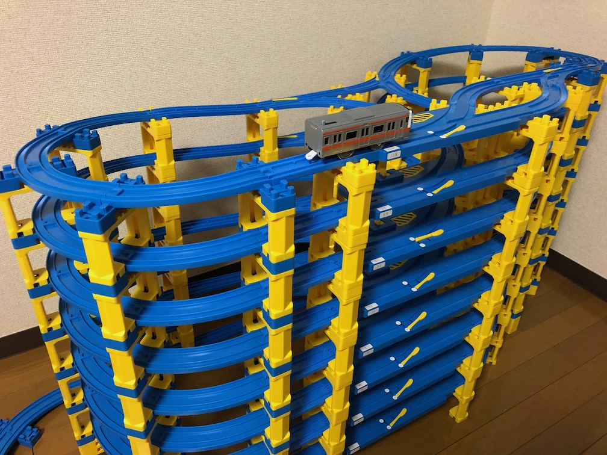
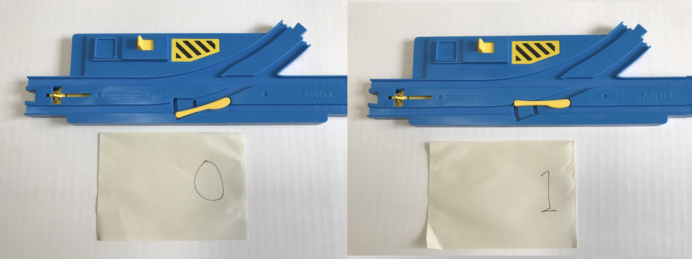
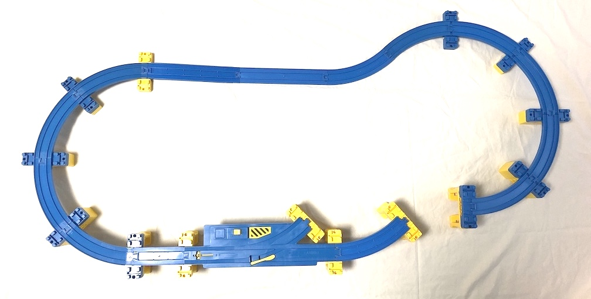
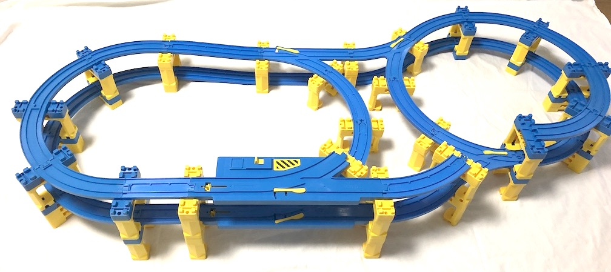
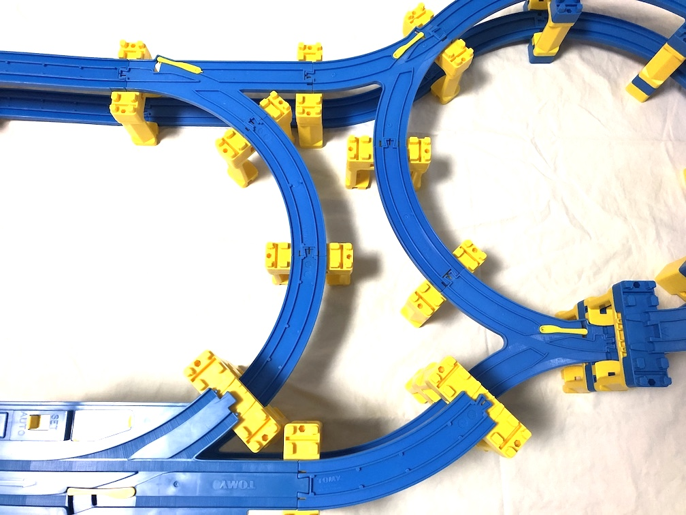
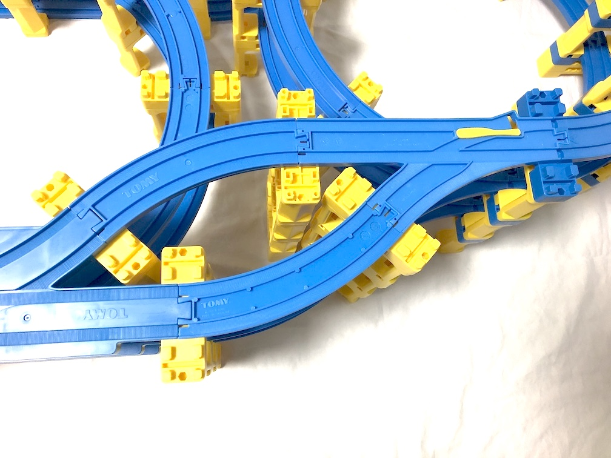
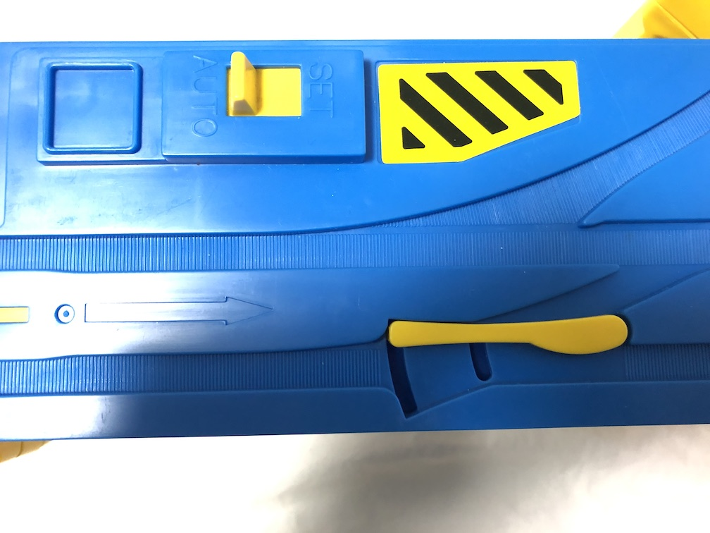
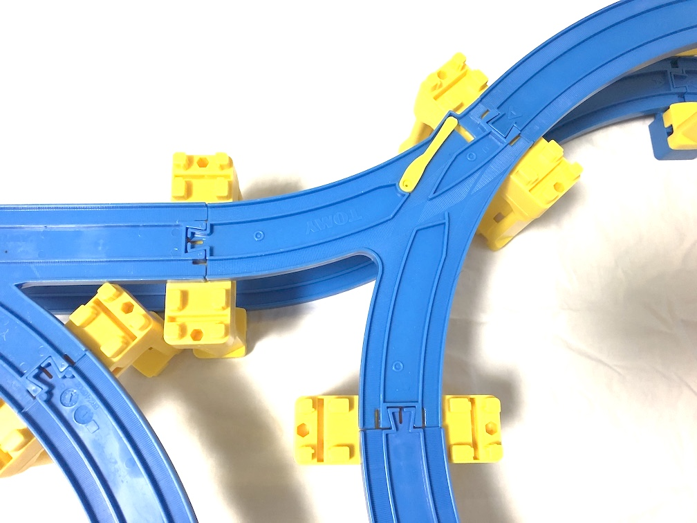

# 鉄道模型nビットカウンタ (2023年版)

## これはなに？
これは鉄道模型おもちゃのひとつであるプラレールを用いて実装したnビットの二進数カウンターです。

二進数カウンターとは2進数で表現された数値を1サイクルごとに1増やす装置です。
本文書では二進数カウンターに必要な部品、組み立て方、設定方法、および使い方を説明します。

## 遊び方
自動ターンアウトレール（いちばん大きな部品）のポイントの向きを二進数のビットだと解釈します。
今回は、ななめ方向が0、真っ直ぐな方向が1としています。

そして、積み重ねたレールの一番上がMSB（最上位ビット）、一番下がLSB（最下位ビット）として、
二進数として読み取ることができます。

電車を一番下の段から反時計回りに走らせると計算が始まります。
電車が一番下の段を通過するたびに二進数の値が1つずつ増加していきます。
そして最後には0に戻る...というのを繰り返します。

## 動作の原理
論理回路において、入力に応じてTフリップフロップという結果を反転する素子があります。
これをn個用いてnビットの二進数カウンタを作れることはよく知られています。
プラレールでも同じように、タイミングによって結果を反転する自動ターンアウトレールというレールがあります。
そしてこのレールをn個組み合わせることにより、プラレールでnビットのカウンタを作ることができます。

## 組み立て方
### 組み立てに必要な部品
必要な部品の点数は何ビットのカウンタを作るかによって変わります。
ここでは*n*ビットのカウンタを作るとして、以下の表に示した数の部品が必要になります。
（手作業で数えたのでもしかするとズレがあるかもしれません）

|部品の名前|必要な数|8ビットで作る場合の数|備考|
|:--|--:|--:|:--|
|直線レール| *1* | *1* ||
|曲線レール| *4n - 1* | *31* ||
|坂曲線レールA | *5n* | *40* ||
|坂曲線レールB | *4n* | *32* ||
|8の字ポイントレールL | *n - 1* | *7* ||
|8の字ポイントレールR | *n - 1* | *7* ||
|坂直線レール | *n* | *8* |廃盤|
|自動ターンアウトレール | *n* | *8* ||
|1/2直線レール| *n* | *8* ||
|ターンアウトレールL | *n* | *8* ||
|橋脚 | *22n - 15* | *161* ||
|ミニ橋脚 | *13n + 5* | *109* ||

### 組み立て方
#### 1. 1段目を下図のように組みます。
直線が2本連なってる箇所は、片方が坂直線レールであることに注意してください。
1段あたり橋脚1つ+ミニ橋脚1つ分の高さがあります。

#### 2. 2段目からn段目はこんな感じで上方向に積み重ねていってください。

また、8の字レールの周りは凹凸が複雑なので、拡大下図を確認してください。

希望するビット数になるまで、2. の工程を繰り返し上にどんどん積み上げてください。

#### 3. nビット目まで積み上げたら、ターンアウトレールを使ってレイアウトを閉じます。

#### 4. これで完成です！

### 設定
実際に走行させる前に、以下の2点の設定を行ってください。

#### 1. すべての自動ターンアウトレールのモードをAUTOにする
この設定を行わないと、いわゆるトグル動作ができなります。すべての自動ターンアウトレールの設定をAUTOにしてください。

#### 2. すべての8の字ポイントレールRの向きを内向きにする
この設定を行わないと、電車が逆走することになります。図のように、８の字ポイントレールRの向きを内向きにしてください。

## 既知のバグ
### 廃盤となった種類のレールを使っている
坂直線レールはプラレールアドバンス用にリリースされたレールであり、すでに廃盤となっており入手困難です。
OSC 2023 Tokyo/Spring で展示する際のスペース上の理由でこのレールを採用しましたが、
将来的にはニュー坂レールといったより標準的なレールで代用すべきです。

## 設計に至った背景（どこかに投稿したい）
1. カウンタはこのように作れます（1列に連なった自動ターンアウトレールの写真）
2. 机の上に収まるサイズにするには工夫が必要です。すなわち、上の方向に積んでいきます。
3. S時の部分はこだわりポイントです。こうすることによって、最終段の接続をスムーズにできます。
4. ８の字レールをわざと使っています。凹凸を揃えるためです。
5. 1段に付き5個上げることによって坂曲線レールを積み重ねることができます。
6. 一番下のところは電車を出し入れしやすくするためにちょっと伸ばしました。

## ライセンス
組み立て手順をソースコード、組み立てられたレイアウトをバイナリ（machine-executable object）と解釈し、
本文書はBoost software license で提供します。
そのため、組み上げた鉄道模型nビットカウンタを展示する際のライセンス表記は不要ですが、
本文書を改変して再利用する場合はライセンスに従ってください。
また、本実装に用いているプラレールは株式会社タカラトミーの登録商標であることに十分留意してください。
